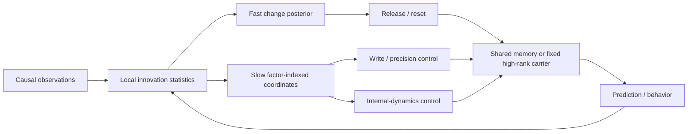

# Actuator Matching Principle

Flexible computation need not retrain a full network for every task. A system
can reuse a fixed high-dimensional carrier and a small dictionary of control
motifs, then select the actuator that best matches the task's demand on input
mapping, internal dynamics, or associative memory.

The active hypothesis is deliberately narrower than the project's original
physical-low-rank proposal:

> Low-dimensional credit and belief signals can control useful low-dimensional
> effective dynamics on a high-rank substrate; task performance depends on
> matching the controller's actuator family to the required computation.

Low matrix rank alone is never evidence. A result must improve held-out
behavior or prediction, and its conclusion is always one of `support`,
`oppose`, or `inconclusive` at the registered seed/session/animal level.

## Evidence status

The repository has two exhaustive and mutually exclusive result views:

- [Current evidence](results/current/README.md) contains only active
  foundations, core results, and open endpoints.
- [Historical evidence](results/history/README.md) contains every superseded,
  rejected, abandoned, or exploratory proposal, including its original
  positive, negative, failed, and inconclusive rows.

The [experiment registry](provenance/experiment_registry.csv) classifies every
entry point from Exp00 through Exp40. The [branch audit](docs/branch_consolidation.md)
shows that all other remote branches were already ancestors of the audited
base, so no implementation commit was missing. Hash-bound snapshots preserve
their prior README/report/summary surfaces.

The current evidence chain is:

1. Exp08: low-dimensional credit can coexist with high-rank physical E/I
   updates after mask, Dale, and normalization operations.
2. Exp09/10/21: leakage-safe hidden belief can modulate bounded effective
   dynamics on a frozen high-rank Dale E/I receiver.
3. Exp11: real IBL behavior gives mixed but useful evidence for past-only
   hidden-block inference; it is not neural validation.
4. Exp24/26: synthetic task demand reverses which actuator family is useful.
5. Exp29: an independently evaluated descriptor selector improves over one
   globally fixed family.
6. Exp31: executed scalar reward selects between two fixed motifs in reset
   blocks.
7. Exp32: persistent sparse-feedback control supports at the slow-switch main
   endpoint, while the stronger registered timescale phase claim remains
   inconclusive.
8. Exp33/34: real ORBIT video rejected the first cross-user reward-only
   selector, then produced a bounded prefix-consistency gain over weak causal
   controls. Exp34 is retained as historical motivation.
9. Exp35: the decisive same-tape audit **opposes** prefix consistency as a
   useful reliability router. Equal prefix probability reaches 81.90% versus
   75.92% for consistency, and the exact stable-wrong control yields accuracy
   zero and wrong-lock fraction one. Exploratory evidence favors within-video
   temporal accumulation; heterogeneous-bank value remains inconclusive.
10. Exp36: the prospectively frozen ORBIT-India cohort is historical and
   inconclusive because only 4/12 collectors could instantiate the registered
   schema; its outcome-blind audit did not inspect accuracy.
11. Exp37: the untouched CORe50 session-held panel **opposes** the registered
   hard-reset BOCPD controller. It exactly matches cumulative accumulation at
   39.84% hidden-switch accuracy and is far below selected current-frame
   forgetting (93.13%) and a two-frame window (92.21%). The stop rule triggers.
12. Exp38: the prospective Stream-51 qualification **opposes** the registered
   joint readiness gate (0/5 seeds). Oracle headroom and cumulative switch harm
   hold, but causal reachability is not robust; external data remain untouched
   and the main utility claim is inconclusive.
13. Exp39: a frozen synthetic factorial task supports an **average** held-out
    predictive gain across four unseen composition cells over fixed and
    seen-mode comparators. The controller is therefore described as using
    factor-indexed adaptive coordinates, not as identifying separate physical
    \(h/Q/R\) states: cell `110` is negative against both comparators, the
    \(Q/R\) coordinates cross-load strongly, and early-in-block NLL is worse
    than seen-mode IMM.
14. Exp40: on the outcome-exposed 30-animal IBL development cohort, structured
    semi-Markov state improves block-context NLL but the three-state controller
    does not improve held-out low-contrast choice NLL. Meaningful utility and
    the precision-clamp claim are opposed; the disjoint cohort and neural stage
    remain locked.
15. Exp25: the real compositional neural endpoint remains active but correctly
    fails closed because an eligible canonical neural bundle is unavailable.

See the [formal principle ledger](docs/actuator_matching_principle.md) and
[current critical audit](docs/current_evidence_critical_audit.md) for effect
sizes, boundaries, and scale priorities.

The [Exp35--Exp38 historical audit](results/history/adaptive_memory_exp35_exp38_20260726.md)
records the decisive Exp35 stop decision and remains the historical contract
for the bounded negative mechanism audit *When Consistency Is Not Reliability:
A Causal Audit of Streaming Personalized Recognition*. Exp37 and Exp38 are
prospective follow-up stop results, not positive method extensions. The active
synthetic successor is Exp39, whose eligible claim is narrower: average
prediction on the four registered held-out composition cells. Its additive
[engineering and claim lock](docs/exp39_engineering_and_claim_lock_20260727.md)
records exact replay checks and post-hoc claim boundaries without changing the
frozen algorithm, protocol, or result artifacts. The
[Exp41 matched-identifiability protocol](docs/exp41_matched_identifiability_development_protocol_20260727.md)
is development-only and must test matched \(Q/R\) alternatives before any new
confirmation claim. [Exp42](docs/exp42_actuator_factorization_audit_plan_20260727.md)
remains locked behind an Exp41 go decision.

The [Exp40 historical development audit](results/history/exp40_ibl_factorized_state_development_20260726.md)
records the synthetic-to-real transfer boundary: better hidden-block decoding
did not yield held-out behavioral utility, so no new IBL cohort or neural data
were opened.

The [historical evidence registry](results/history/README.md) separates theory
errors from identification, method, and data failures. The
[current critical audit](docs/current_evidence_critical_audit.md) records the
active contribution boundary and stop rules.

## System architecture

The active computational hypothesis is deliberately smaller than the full
historical programme:



Exp41 tests whether the slow Q/R coordinates are identifiable under matched
one-step marginals. Exp42 may test actuator matching only after that gate;
real behavior, neural shared dynamics, and a participating E/I carrier remain
conditional later stages. Historical-only branches stay in the evidence
registry rather than the active computation graph.

## What is not currently claimed

- Low-dimensional feedback does not imply a low-rank physical recurrent
  matrix.
- The rate-matched independent phase-gate proposal is rejected in this model.
- The tested Exp23 local gain-axis rule/budget does not improve held-out
  behavior and is historical only.
- The ARC, maze, Sudoku, tiny-HRM, and recursive baseline experiments are
  historical capability probes, not evidence for the active neural theory.
- Exp31/32 do not yet contain a participating high-rank E/I carrier.
- Exp34 does not establish SOTA or efficiency: its official-style 67.43% is
  effectively tied with the published EfficientNet-B0 cosine ProtoNet 67.48%,
  and the controller computes the full four-actuator bank.
- Exp35 supersedes Exp34 as the paper-level verdict: stronger same-tape causal
  baselines remove and reverse the router gain, so Exp34 is historical rather
  than current positive method evidence.
- Exp35's positive prefix-accumulation decomposition is retrospective and
  exploratory; it is not a prospective transfer or novelty claim.
- Exp37 does not show that change-point detection is generally useless. It
  opposes the registered categorical-BOCPD hard reset on CORe50; the maximum
  development change posterior (0.00853) never approached the minimum frozen
  threshold (0.2), and that post-hoc diagnosis cannot rescue the verdict.
- Exp40's improved block-context NLL does not establish a useful release or
  precision actuator. Its outcome-exposed behavioral gate failed, and no
  disjoint IBL or neural result is claimed.
- Exp39 does not establish uniform unseen-composition dominance: cell `110`
  loses on mean NLL, and the registered result is an average over the four
  held-out cells `011`, `101`, `110`, and `111`.
- Exp39 does not identify three clean uncertainty variables. Its reported
  \(h/Q/R\) quantities are factor-indexed adaptive coordinates; the post-hoc
  loading audit shows substantial \(Q/R\) cross-loading.
- Exp39's frozen `early_nll` is an early-in-block metric and includes each
  sequence's initial block. A transition-only recomputation is post-hoc and
  also finds worse early NLL than seen-mode IMM.
- Exp39 is wholly synthetic and supplies no behavioral, neural, E/I, or
  biological mechanism validation.
- No shared gated model has yet beaten common dynamics on the required
  multi-animal/session neural dataset.
- The project does not claim general SOTA, a biological MD/ACC identity, or a
  replacement for arbitrary history or KV cache.

## Reproducibility contract

- Python 3.11 only.
- NumPy, SciPy, pandas, scikit-learn, PyTorch, matplotlib, and statsmodels;
  ONE-api/ibllib are optional and isolated to IBL acquisition.
- Every stochastic entry point receives and records an explicit seed.
- Local-learning candidates do not use autograd or BPTT. BPTT/GRU appear only
  as isolated baselines.
- Trials or blocks, never individual time points, define train/test folds.
- Scaling, PCA, subspaces, nuisance regression, and latent-dimension selection
  are fit inside training folds.
- Seed, session, or animal is the independent statistical unit; neurons and
  time bins are never treated as independent replicates.
- Failed, invalid, infeasible, and missing conditions remain first-class
  output rows; joint claims use AND gates rather than success-selecting OR
  rules.

## Repository layout

- `src/`: tasks, models, plasticity rules, analysis, and data adapters.
- `experiments/`: all current and historical executable entry points. See
  [their status index](experiments/README.md) before running one.
- `configs/`: smoke and formal frozen configurations.
- `results/current/`: active evidence indexes and current-only claim rows.
- `results/history/`: historical experiment index, branch snapshots, failed
  rows, and immutable-object provenance.
- `provenance/`: authoritative experiment/branch/object registries.
- `scripts/build_evidence_views.py`: validates provenance and deterministically
  regenerates the two evidence views.
- `scripts/audit_branch_reachability.py`: proves that every deleted branch tip
  is reachable from the consolidation commit and audits later-deleted files.

## Reproduce the consolidated state

On Windows, bootstrap the project-local Python 3.11 environment and run all
tests:

```powershell
./scripts/bootstrap_windows.ps1
.\.venv\Scripts\python.exe -m pytest -q
.\.venv\Scripts\python.exe scripts\build_evidence_views.py
.\.venv\Scripts\python.exe scripts\audit_branch_reachability.py
git diff --exit-code -- results\current results\history\README.md `
  results\history\experiments.csv results\history\branches.csv `
  results\history\claims.csv results\history\git_objects.csv `
  results\history\snapshot_manifest.csv `
  results\history\branch_reachability.csv
```

Formal experiment commands and immutable package-specific receipts are kept in
the corresponding current evidence report or protocol. Historical commands
remain in the archived
[pre-consolidation README](results/history/project_README_pre_consolidation.md),
so reorganizing the active narrative does not erase earlier workflows.
