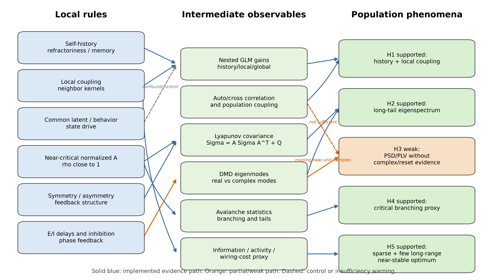

# 深入审计：当前模拟是否完全实现，以及局部规则如何通向整体现象

> `synthetic_calibration / single_seed` 辅助报告；不是生物统计推断。H1 数值已按训练前缀 scaler 的当前代码重新生成。

本报告在原始 goal 的基础上，结合当前仓库结果和相关工作，对 `neural_multiscale_tests` 的完成程度做更严格的审计。结论先行：当前项目已经实现了“可复现合成模拟框架”和主要判据矩阵，但还没有完全实现原始 goal 中的公开数据拟合、真实实验设计、完整行为状态控制、严格 finite-size scaling、严格同步码因果验证。当前最有价值的部分，是它已经能把若干局部规则映射到可观测的整体统计，并能避免把所有现象混成一个统一理论。

## 1. 参考工作的机制启发

| 相关工作路线 | 对本项目的启发 | 对当前实现的审计标准 |
|---|---|---|
| GLM / population coupling | Retina GLM 和 cortical population coupling 工作说明，单神经元 spike 既受自身历史影响，也受邻近或群体活动影响；population coupling 还可能预测 optogenetic response。 | H1 不能只看互相关，必须看 history/local/global 模型的预测增益，并区分局部耦合与共同状态。 |
| 高维响应谱 / critical initialization | Stringer 2019 强调视觉皮层 response spectrum 的高维平滑结构；critical initialization 路线强调近临界、近对称动力学可通过 Lyapunov 协方差产生长尾谱。 | H2 不能只拟合 log-log 斜率，还要验证 A_eff 或生成 A 是否能预测 Sigma。 |
| Avalanche / criticality | Beggs-Plenz 与后续 dynamic range 工作支持临界传播候选机制；Priesemann 等提醒 subsampling、驱动和非平稳会造成伪临界。 | H4 必须同时看 branching ratio、tail model、dynamic range、bin/subsampling/finite-size，而不能只看直线。 |
| Oscillatory synchrony / CTC | Singer/Fries/PING/ING 路线强调相位锁定、振荡窗口和 E/I 反馈，但同步码需要复模态、phase reset 或通信/解码增益支撑。 | H3 中 PSD peak 和 PLV 只是必要不充分条件；若 complex DMD 和 phase reset 不成立，必须降级。 |
| Energy / wiring economy | Attwell-Laughlin、Lennie、Bullmore-Sporns 路线强调 spike 成本、稀疏编码和布线经济。 | H5 需要看信息/活动/布线成本 proxy，最佳点应是稀疏但不过度稀疏、近稳定但不失稳、少量长程而非全局密连。 |

## 2. 完全实现程度审计

| 原始 goal 子任务 | 当前状态 | 是否完全实现 | 缺口 |
|---|---|---:|---|
| 6 类合成模拟 | Baseline、Hawkes、linear dynamics、branching、E/I LIF、energy sweep 均已实现 | 是，模拟骨架完整 | 参数扫描偏 quick；缺重复 seed 置信区间；部分指标是 proxy。 |
| 统一指标 | `summary.json` 输出自相关、互相关、协方差谱、PSD、DMD、雪崩、GLM、能量等 | 基本是 | coherence、真实 spike-field locking、phase reset 还不够严格。 |
| H1 history/local/global 判据 | `glm_comparison` 已比较 bias/history/local/global/full | 基本是 | global/latent 只是简化共同输入，不等价于真实行为/状态回归。 |
| H2 Lyapunov 协方差验证 | `linear_dynamics.py` 输出 alpha、DMD、Lyapunov agreement | 基本是 | exact exponent 未完全复现；quick 规模下 alpha=0.9136，高于 0.7-0.85 经验带。 |
| H4 avalanche 判据 | 有 branching ratio、tail model、dynamic range | 部分 | finite-size scaling、subsampling、bin-size sweep 仍未严格实现。 |
| H3 oscillatory synchrony | 有 E/I LIF、PSD、PLV、DMD、phase reset proxy | 部分 | 未获得 near-unit complex DMD；phase reset 在 gamma_sync case 为负；缺通信/解码增益。 |
| H5 energy constraint | 有 sparsity / long-range / rho grid 和 information/cost | 基本是 | 仍是 proxy，没有真实代谢、spike cost 或 wiring distance 数据。 |
| 公开数据拟合 | 有 `fit_public_data.py` 与 registry | 否 | 未下载/拟合 Allen、IBL、Steinmetz、Stringer、Buzsaki/CRCNS。 |
| 真实实验设计 | 有判据和报告说明 | 否 | 没有形成独立实验方案、扰动协议、样本量、统计检验或真实数据。 |

## 3. 当前结果和原始预期的深层关系

当前结果不是在证明一个统一理论，而是在证明“不同局部规则会留下不同整体指纹”。这点与原始 goal 完全一致。

| 局部规则 | 当前实现 | 中间可观测量 | 整体现象 | 当前证据 |
|---|---|---|---|---|
| 自历史项 | Hawkes 中 `history_strength=1.0` | GLM history delta = 0.0022 bits/bin；自相关提高 | 单神经元历史依赖 | H1 strong 的一部分 |
| 局部耦合 | Hawkes 中 `local_strength=6.0` 和邻域 kernel | local delta = 0.0081 bits/bin；Hawkes mean xcorr = 0.0328 > baseline 0.0290 | 局部网络相关和 population structure | H1 strong 的主要来源 |
| 共同状态 | Hawkes 中 common latent/stimulus；GLM 有 global/full 比较 | global delta = 0.0018 bits/bin；full delta 不一定继续提升 | 区分局部耦合和共同状态混淆 | 机制存在，但真实行为控制未完成 |
| 近临界谱半径 | Linear A 的 target rho 接近 1 | critical symmetric alpha=0.9136；Lyapunov corr=0.9893 | 长尾协方差谱、多尺度模态 | H2 strong，但指数偏高 |
| 对称/非对称结构 | symmetric/mixed/asymmetric A | mixed alpha=0.8264；asymmetric complex fraction=0.9444、alpha=1.5590 | 对称性影响谱形与旋转模态 | 支持“动力学结构塑造整体谱” |
| 分支规则 m | Branching process 扫 m=0.75/0.9/1.0/1.08 | m=1 branching ratio=0.9761；dynamic range peak at m=1 | 临界传播和雪崩统计 | H4 strong，但 finite-size 不完整 |
| E/I 延迟反馈 | LIF E/I 网络 | PSD peak 和 PLV 存在；near-unit complex DMD=0；phase reset=-0.012 | 部分振荡统计，不是同步码 | H3 weak，符合谨慎判据 |
| 稀疏 + 少量长程 + 稳定 rho | Energy sweep | best sparsity=0.09，long-range=0.035，rho=0.9，info/cost=2.0819 | 能量效率最优点 | H5 strong，但代谢 proxy |

## 4. 机制图

图中蓝色实线表示当前已有可执行证据链，橙色表示当前只有弱证据或必要条件不足，虚线表示控制项或“不充分证据”警告。

## 5. 关键发现

1. **H1 不是简单相关，而是预测增益链条。**  
   当前 Hawkes 模拟显示 local coupling 的 GLM 增益大于 history 和 global 项，说明局部规则确实通过邻域 spike history 映射到整体互相关和预测提升。但真实数据中，behavior/latent state 仍可能解释部分相关，因此真实 H1 还必须做状态控制。

2. **H2 的局部到整体链条最清楚。**  
   线性随机系统中，局部规则就是矩阵 A 的谱半径、对称性和噪声项；整体现象是协方差谱。Lyapunov 方程把两者直接连接起来，因此当前 H2 是最像“机制模型”的部分。缺点是当前 exponent 没完全落在目标文本引用的经验范围内。

3. **H3 的负结果很重要。**  
   E/I 网络能产生 PSD peak 和 PLV，但没有 near-unit complex DMD 和 positive phase reset。这说明“局部 E/I 反馈 -> 有振荡统计”不等于“局部 E/I 反馈 -> 同步码”。当前结果支持原始 goal 的反过度解释原则。

4. **H4 支持临界传播候选机制，但还未达到真实数据标准。**  
   分支过程里 m=1 给出 branching ratio 接近 1 和 dynamic range 峰值，这是教科书式机制链条。但真实 spike avalanche 容易受 binning、subsampling 和外部驱动影响，当前还没有完成这些控制。

5. **H5 给出的是工程化 proxy，不是生理代谢证明。**  
   当前能量模型展示了局部连接、少量长程连接、稀疏活动和稳定谱半径之间的效率折中。这个链条与 wiring economy 思路一致，但还需要真实 firing rate、代谢 proxy 或 wiring distance 才能转成生物学强证据。

## 6. 当前模拟最该补的执行项

按收益和与原始 goal 的贴合度排序：

| 优先级 | 应补内容 | 原因 |
|---:|---|---|
| 1 | 多 seed + 参数 sweep 汇总，输出置信区间 | 当前 quick run 容易把 seed 特异性当成机制强证据。 |
| 2 | Avalanche bin-size sweep + subsampling + finite-size scaling | 这是 H4 从 toy criticality 到真实数据判据的关键差距。 |
| 3 | 行为/latent residual control 的真实实现 | H1 和公开数据拟合必须区分局部耦合与共同状态。 |
| 4 | E/I 网络的 phase-reset protocol 和 DMD on rates/latent state | H3 当前是弱证据，若要验证同步码，必须做更强扰动设计。 |
| 5 | Public data adapter 的一个真实小样本 smoke dataset | 原始 goal 明确要求公开数据拟合，目前仍停在接口层。 |
| 6 | eigenmode perturbation simulation | 连接 H2 谱结构和因果传播，是从相关到机制的重要桥梁。 |

## 7. 最终判断

当前实验模拟**没有完全实现原始 goal 的全部范围**，但已经实现了核心合成模拟框架和局部规则到整体现象的主要可检验链条。更准确的状态是：

- **合成模拟层：基本实现。**
- **机制区分层：基本实现，H3 按判据正确降级。**
- **公开数据层：接口实现，数据拟合未实现。**
- **真实实验层：判据说明存在，实验方案和数据验证未实现。**
- **局部到整体关系：H1/H2/H4/H5 已有清晰链条，H3 显示必要条件不足。**

因此，当前项目最适合作为“竞争理论筛选与实验设计原型”，还不是“完整神经群体动力学验证平台”。

## 8. 参考工作入口

这些工作用于指导上面的审计逻辑，而不是作为当前合成结果已经验证真实脑机制的证据。

- Pillow et al., *Spatio-temporal correlations and visual signalling in a complete neuronal population*, Nature 2008: https://www.nature.com/articles/nature07140
- Okun et al., *Diverse coupling of neurons to populations in sensory cortex*, Nature 2015: https://www.nature.com/articles/nature14273
- Stringer et al., *High-dimensional geometry of population responses in visual cortex*, Nature 2019: https://www.nature.com/articles/s41586-019-1346-5
- Pachitariu et al., *A critical initialization for biological neural networks*, Nature 2026: https://www.nature.com/articles/s41586-026-10528-1
- Beggs and Plenz, *Neuronal Avalanches in Neocortical Circuits*, Journal of Neuroscience 2003: https://www.jneurosci.org/content/23/35/11167
- Shew et al., *Neuronal avalanches imply maximum dynamic range in cortical networks at criticality*, Journal of Neuroscience 2009 / arXiv entry: https://arxiv.org/abs/0906.0527
- Fries, *A mechanism for cognitive dynamics: neuronal communication through neuronal coherence*, Trends in Cognitive Sciences 2005: https://doi.org/10.1016/j.tics.2005.08.011
- Attwell and Laughlin, *An energy budget for signaling in the grey matter of the brain*, Journal of Cerebral Blood Flow and Metabolism 2001: https://journals.sagepub.com/doi/pdf/10.1097/00004647-200110000-00001
- Bullmore and Sporns, *The economy of brain network organization*, Nature Reviews Neuroscience 2012: https://www.nature.com/articles/nrn3214
