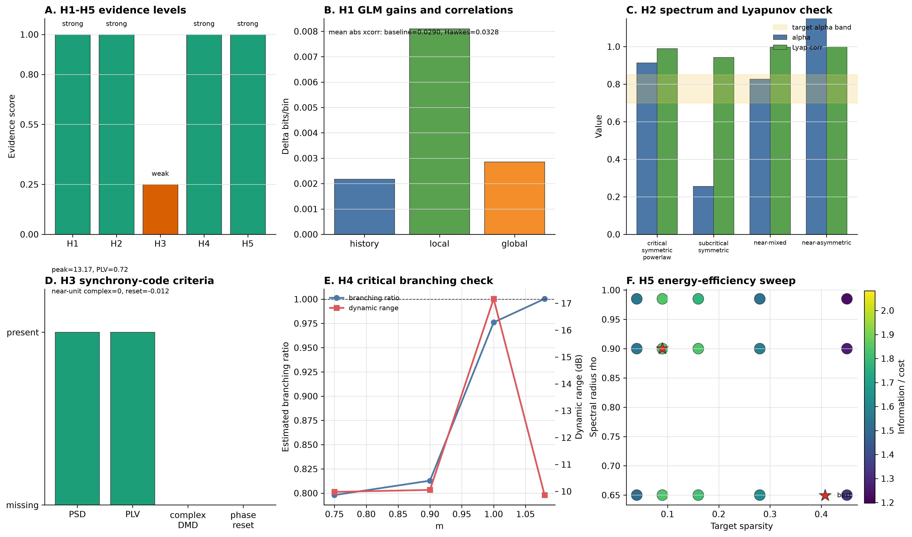

# 原始 Goal 预期一致性检查与结果可视化

> `synthetic_calibration / single_seed` 辅助报告；不是生物统计推断。H1 数值已按训练前缀 scaler 的当前代码重新生成。

本报告参考原始粘贴文本中的目标，检查当前 `neural_multiscale_tests` 完成情况与预期是否一致，并给出必要结果可视化。当前结论基于 `reports/summary.json` 与 `reports/decision_matrix.json`，不把合成模拟结果外推为真实脑数据事实。

## 可视化总览

对应文件：

- PNG: `figures/goal_alignment_visual_summary.png`
- PDF: `figures/goal_alignment_visual_summary.pdf`
- 绘图脚本: `figures/goal_alignment_visual_summary_plot.py`

## 1. 与原始预期的总体一致性

| 模块 | 原始预期 | 当前结果 | 一致性判断 |
|---|---|---|---|
| Baseline 独立 Bernoulli | 无历史/无耦合时不应自动产生强机制证据 | baseline 平均互相关为 0.0290，作为 negative control 使用 | 一致 |
| H1 历史相关 + 局部耦合 | history-only 与 local-coupled 应带来预测增益 | history delta = 0.0022 bits/bin；local delta = 0.0081 bits/bin | 一致 |
| H2 近临界/幂律谱 | 近对称、近临界线性系统应产生长尾谱，且 Lyapunov 方程能预测协方差 | alpha = 0.9136；Lyapunov log-eig corr = 0.9893 | 基本一致，但 alpha 高于目标文本中约 0.7-0.85 的经验范围 |
| H3 振荡同步码 | 只有 PSD/PLV 不够，需 complex DMD 与 phase reset | PSD peak ratio = 13.17、PLV = 0.722，但 near-unit complex DMD = 0、phase reset = -0.012 | 与“不能过度声称同步码”的预期一致；与“强同步码证据”不一致 |
| H4 雪崩/临界传播 | m≈1、branching ratio 接近 1、dynamic range 峰值接近临界 | m=1 case branching ratio = 0.9761；dynamic range 最优 m = 1.0 | 一致 |
| H5 能量约束 | 中等稀疏、少量长程连接、rho<1 时信息/成本最高 | best sparsity = 0.09；long-range = 0.035；rho = 0.9；information/cost = 2.0819 | 一致 |
| 公开数据拟合 | 需 Allen/IBL/Steinmetz/Buzsaki 等真实数据拟合和行为状态控制 | 已实现统一接口和 registry，未实际下载/拟合真实公开数据 | 未完成真实数据层验证 |
| 真实实验设计 | 需从局部 MEA 到中观 Neuropixels/opto 再到宏观 ECoG/MEG/fMRI 的实验判据 | 当前主要是模拟 pipeline 与判据说明，没有独立实验方案和真实扰动数据 | 部分完成 |

## 2. 图中各面板解释

**A. H1-H5 evidence levels**  
H1、H2、H4、H5 当前为 strong，H3 为 weak。这个分布与原始 goal 的谨慎态度一致：同步码不能只靠相关性、PSD 或 PLV 来证明。

**B. H1 GLM gains and correlations**  
history/local/global 三个嵌套 GLM 增益中，local coupling 增益最大。Hawkes 合成数据平均互相关 0.0328，高于 baseline 0.0290，说明局部耦合生成器确实产生了可检测的群体相关结构。

**C. H2 spectrum and Lyapunov check**  
critical symmetric power-law case 的 alpha 和 Lyapunov covariance agreement 均较高，说明当前 pipeline 不只是拟合一条幂律线，还检查了动力学模型对协方差谱的预测能力。需要注意：当前 alpha=0.9136，高于文本中引用的约 0.7-0.85 经验范围，因此更适合解读为“机制可复现”，不是“完全数值复现 Nature 经验范围”。

**D. H3 synchrony-code criteria**  
PSD 与 PLV 两项通过，但 complex DMD 与 phase reset 两项缺失。因此当前结果只支持“存在部分振荡/相位统计特征”，不支持“振荡同步码”。这与原始 goal 的判据一致：普通相关性、PCA 模态或宽泛振荡不能直接证明同步码。

**E. H4 critical branching check**  
branching ratio 在 m=1 附近接近 1，dynamic range 峰值也位于 m=1，符合分支过程临界点的预期。当前实现包含尾部分布模型比较，但 finite-size scaling 仍是简化层面，真实数据上还需要更严格的 subsampling 和 bin-size sweep。

**F. H5 energy-efficiency sweep**  
最优点落在 target sparsity=0.09、rho=0.9、long-range fraction=0.035。这与“中等稀疏、少量长程连接、接近但低于不稳定边界”的能量约束预期一致。该结论来自信息/活动/布线 proxy，不能替代真实代谢测量。

## 3. 当前结论是否符合原始目标

符合的部分：

- 已建立可复现 Python pipeline，并能自动生成 H1-H5 的结构化证据矩阵。
- 六类模拟模型均已实现，且输出指标覆盖原始 goal 中的主要判据。
- 结果解释没有写成“大一统理论已证明”，而是按机制逐项给出 strong/weak 等级。
- H3 被严格降级，避免把 PSD/PLV 误解为同步码强证据。
- H4 没有只靠 log-log 直线，而是同时查看 branching ratio、tail model 和 dynamic range。
- H5 的最优点与原始“中等稀疏 + 少量长程 + rho(A)≤1”的预期一致。

不完全符合或尚未完成的部分：

- 公开数据拟合目前只完成接口和数据集 registry，没有实际拟合 Allen、IBL、Steinmetz、Stringer 或 Buzsaki/CRCNS 数据。
- 行为/状态变量控制只列入接口输出和文档要求，尚未实现具体回归或分层控制。
- E/I spiking network 没有产生强同步码证据；这不是失败，而是当前结果支持“同步码证据不足”的结论。
- finite-size scaling、coherence、phase reset、spike-field locking 等指标仍有轻量 proxy 成分，真实论文级验证需要扩展。
- 真实实验设计尚未成为独立实验方案文档，也没有真实 optogenetic / MEA / Neuropixels 数据。

## 4. 总结

当前完成情况与原始 goal 的核心精神基本一致：它不是证明统一理论，而是建立一套可以区分竞争机制的可复现实验框架。模拟侧的结果和预期高度一致，尤其是 H1、H2、H4、H5；H3 的弱证据结论也与原始文本“振荡同步码需要额外条件”的要求一致。

当前最大缺口在真实数据和真实实验层：公开数据接口已经存在，但还没有实际数据拟合、行为状态控制和因果扰动验证。因此，当前最准确的结论是：合成验证框架已经跑通并产生了与目标判据一致的证据矩阵；真实脑区、真实状态和真实数据集上的结论仍需下一阶段实验来验证。
